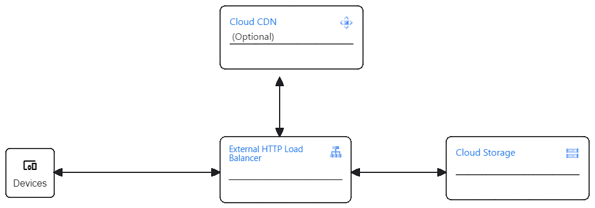

# Cloud resume Challange Frontend

<p align="center">
  <a href="">
    
  </a>

  <h3 align="center">Google Cloud Platform (GCP) Resume Challenge </h3>

  <p align="center">
    Build a serverless resume website on GCP with API backend and GitOps-based CI/CD
    <br />
    <br />
    <a href="http://34.49.56.203/my_resume.html" target="_blank">View Demo</a>
    <br />
    <a href="https://github.com/csgergo88/GCP-Cloud-Resume-Challenge-Frontend/issues">Report Bug</a>
    ·
    <a href="https://github.com/csgergo88/GCP-Cloud-Resume-Challenge-Frontend/issues">Request Feature</a>
  </p>
</p>

This repository contains the frontend code for the Cloud Resume Challenge. In case you are interested in backend then it's located [here](https://github.com/csgergo88/GCP-Cloud-Resume-Challenge-Backend). The deployment process is streamlined using the deployment.ps1 script, allowing for easy deployment of the frontend to Google Cloud Platform (GCP). This README provides guidance on using the deployment script and deploying the frontend to GCP.

## Architecture


## Current <b>frontend</b> design



To check backend click [here](https://github.com/csgergo88/GCP-Cloud-Resume-Challenge-Backend)

## Prerequisites
Before using the deployment script, ensure you have the following prerequisites:

- [Google Cloud SDK (gcloud)](https://cloud.google.com/sdk/docs/install) installed and configured.
- GCP project created and configured.
- PowerShell environment for running the deployment script.
- Terraform (optional)

## Usage

1. Clone the repository:
   ```
   git clone https://github.com/csgergo88/cloud-resume-frontend.git
   cd cloud-resume-frontend

You have two options to deploy this project:

 **Using Power Shell:**
Ensure that your variables.ps1 file is correctly configured with your GCP project, Cloud Run service URL, and preferred region:

```
   $region = "us-east1"
   $project = "resumechallangetest"
   $cloudrunserviceurl = "https://test-h5jqdffluq-ue.a.run.app"
   $bucket_name = "resume_challange"
```	

Run the deployment script:

```
   .\deployment.ps1
```
Wait for the deployment process to complete. This includes creating a storage bucket, updating the resume HTML with the Cloud Run service URL, granting access to all users, and setting up a CDN and Load Balancer.

**Using Terraform:**
  - Ensure that your variables in *terraform.tfvars* matches your target deployment
  - Initialize directory, plan, review and apply
```
  cd ./infra
  terraform init
  terraform plan
  terraform apply
```
  
After the deployment is successful, you can access your Cloud Resume frontend using the Load Balancer IP provided in the script output.

## Notes
Ensure that the *variables.ps1/terraform.tfvars* file is correctly configured with your GCP project, Cloud Run service URL, and preferred region before running the script.
The script creates a storage bucket, updates the HTML with the Cloud Run service URL, and sets up a CDN and Load Balancer to serve the frontend.
Feel free to customize the script or HTML file according to your specific requirements. For any issues or improvements, please open an issue or pull request on the repository.


## Roadmap

Things missing in the project due to time constraints that I would like to implement in the future

* Add unit-test code for the frontend and backend
* Register cloud domain and add DNS functionality to project
* Setup Cloud Build CI/CD env
* Merge the forntend and backend into a single repo
* Use environment variables and git branches to be able to deploy to dev staging and prod environments on demmand.
* Make a step-by-step guide to implement the project

See the [open issues](https://github.com/alfonsmr/gcp-resume-challenge-frontend/issues) for a list of proposed features (and known issues).

Happy coding!
